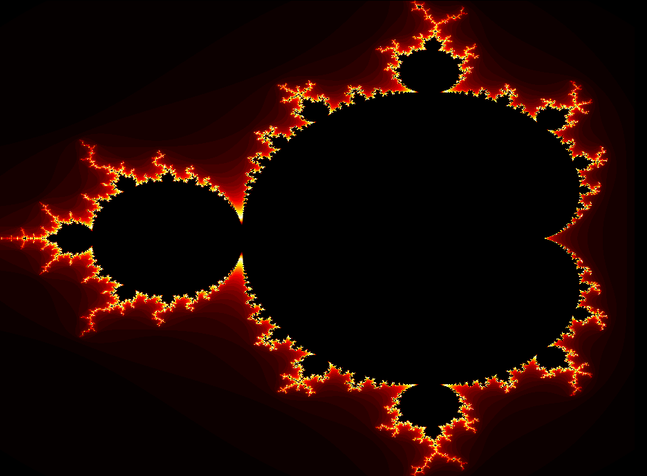
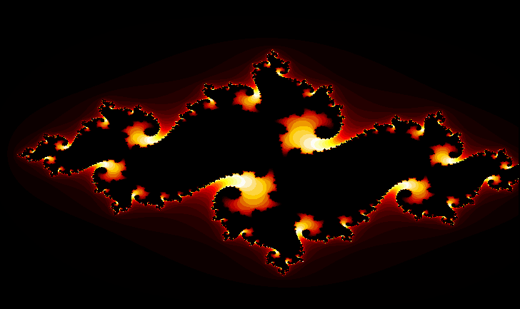
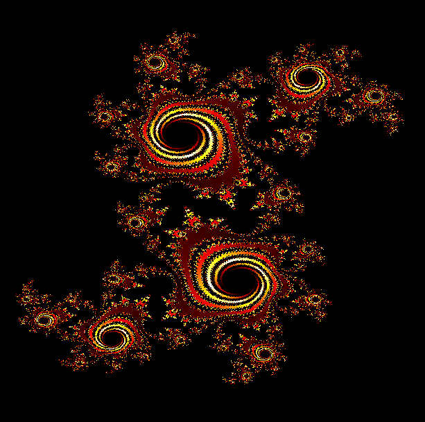
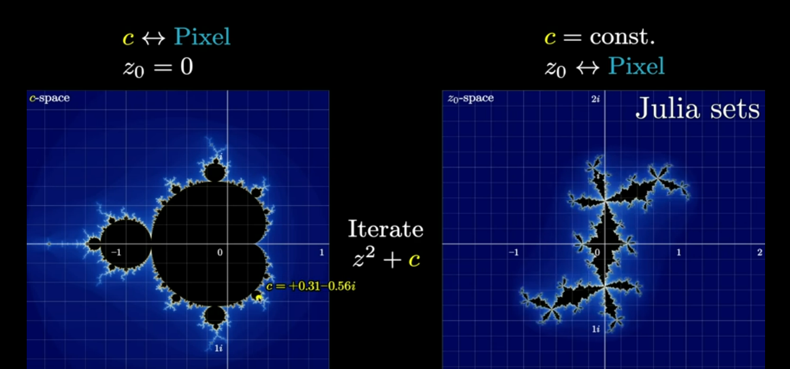
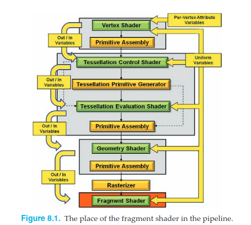

# Assignment 3: Fractal Shaders 🪞

<table border=0 align=center>
    <tbody>
        <tr>
     	    <td width="27%" align="center">  </td>
			<td width="27%" align="center"> </td>
			<td width="27%" align="center"> </td>       
        </tr>
    </tbody>
</table>

<br>


**tl;dr**: In this project...

## Usage

```bash
python mandelbrot.py --width 680 --height 680 --max_iteration 50
python mandelbrot.py --width 680 --height 680 --max_iteration 75
python mandelbrot.py --width 680 --height 680 --max_iteration 100
python julia.py --max_iterations 75 --cx -0.8 --cy -0.156 # standard julia set
python julia.py --max_iterations 75 --cx -0.123 --cy 0.745 # douady's rabbit
python julia.py --max_iterations 75 --cx -0.75 --cy 0.11 # seahorse valley
python julia.py --max_iterations 75 --cx -0.74543 --cy 0.11301 # triple spiral
python julia.py --max_iterations 75 --cx -0.745 --cy 0.1135 # devil's claws
python julia-dyn.py --max_iterations 230 --width 1260 --mincolor -0.066 --maxcolor 0.53 --speed 0.84
```

It's possible to write videos with the `--out` flag. For instance, we can save a video called `lala.mp4`:

```bash
python julia-dyn.py --max_iterations 250 --width 1260 --mincolor -0.066 --maxcolor 0.56777 --speed 1.45 --out lala
```

## Math Background: Holomorphic Dynamics

Holomorphic refers for a function that maps complex numbers input to complex numbers output.

$$
f:\mathbb{C}\rightarrow\mathbb{C}
$$

The derivative of a holomorphic function exists at every point in its domain, and is itself a holomorphic function.


For some function $f(z)$, the Mandelbrot set is the set of complex numbers $c$ for which the iterated function $f(z)$ does not diverge when starting with $z=0$.

Dynamics refers that we apply the function over and over and over...

$$
z_{0}\rightarrow z_{1}\rightarrow z_{2}\rightarrow\dots \rightarrow z_{n+1}
$$

$$
z_{n+1} = f(z_{n})
$$

### Rational Functions

A function is rational if it can be expressed as the quotient of two polynomials, such as

$$
f(z) = \frac{2z^3 + 1}{3z^2}
$$ 

or, more generally,

$$
f(z) = \frac{a_{n}z^{n}+\dots+a_{0}}{b_{m}z^{m}+\dots + b_{0}}
$$

What happens when we iterate as before some rational functions? Let's start with the simple function $z_{n+1} = z_{n}^{2} + c$, where $c$ is a constant that can be changed. For instance, could be $c=-0.52 + 0.35i$. We can start with an initial $z_{0}=0$ , so

$$
\begin{equation}
\begin{split}
z_{0} &= 0 \\
z_{1} &= 0^{2} + c = c \\
z_{2} &= c^{2} + c \\
z_{3} &= (c^{2} + c)^{2} + c \\
z_{4} &= ((c^2 + c)^2 + c)^2 + c \\
\vdots
\end{split}
\end{equation}
$$

For some values of $c$, the sequence $z_{n}$ will diverge to infinity. For others, it will converge to a fixed point. For others, it will converge to a cycle of length 2, 3, 4, etc. For instance, if $c=0$, then $z_{n}=0$ for all $n$. If $c=1$, then $z_{n}=1$ for all $n$. If $c=-1$, then $z_{n}$ will alternate between $-1$ and $0$.

 
### The Mandelbrot set: $z_{0}$ is fixed

We can define the set of complex numbers $c$ for which the iterated function $f(z)$ does not diverge and stay bounded. This is the Mandelbrot set.

### The Julia set: $z_{0}$ is not fixed

<center>

</center>


## Vertex Pipeline

<center>

</center>

**TODO:** Fractals are used heavily uniform variables across the vertex and fragment shaders. The vertex shader is responsible for transforming the vertices of the geometry into screen space. The vertex shader is also responsible for passing the uniform variables to the fragment shader.


## Dependencies

```bash
pip install -r requirements.txt
```

## Resources

* [Beyond the Mandelbrot set, an intro to holomorphic dynamics - 3Blue1Brown](https://www.youtube.com/watch?v=LqbZpur38nw)
* [How to Fold a Julia Fractal, a tale of numbers that like to turn - Steven Wittens](https://acko.net/blog/how-to-fold-a-julia-fractal/)
* [Fast and Easy High Resolution Fractals with a Pixel Shader - John Tsiombikas](http://nuclear.mutantstargoat.com/articles/sdr_fract/)
* [Julia Set Fractal (2D) - Paul Bourke](http://paulbourke.net/fractals/juliaset/)
